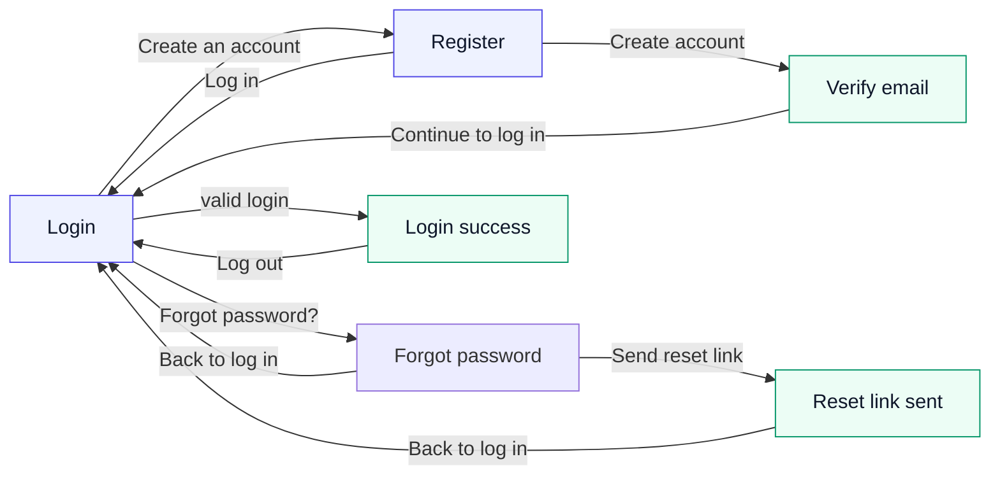

# LearnFlow — Auth Frontend (UC-1)

React 19 + Tailwind CSS v4 + Vite + TypeScript. The login / register surfaces for
LearnFlow LMS, built from the **LearnFlow Auth** design handoff (claude.ai/design)
and grounded in [`../backend/UC-1-requirements.md`](../backend/UC-1-requirements.md).

- **Audience:** engineers integrating the LearnFlow FastAPI auth backend.
- **What you get:** the six auth screens, the design-system components ported to
  Tailwind, and a typed `/auth/*` client that runs standalone (mock) until the
  backend is up.
- **Identity model:** email is the **sole** identifier — no username, no social/SSO
  (out of scope per the requirements doc).

## Run it

```bash
npm install
npm run dev        # http://localhost:5173  (mock mode — no backend needed)
npm run build      # tsc -b && vite build  → dist/
npm run preview    # serve the production build
```

By default the UI runs in **mock mode** (no backend). To point it at the real
FastAPI backend, copy `.env.example` to `.env` and set the base URL:

```bash
cp .env.example .env
# .env
VITE_API_BASE=http://localhost:8000
```

When `VITE_API_BASE` is set the client POSTs to the real endpoints; if the backend
is unreachable it transparently falls back to the mock so the UI still runs.

## Screen flow



<details>
<summary>ASCII fallback</summary>

```
        Create an account
  ┌───────────────────────────►  ┌──────────┐
  │  ◄───────── Log in ────────── │ Register │
┌─┴─────┐                         └────┬─────┘
│ Login │                              │ Create account
└─┬───┬─┘                              ▼
  │   │ Forgot password?         ┌──────────────┐
  │   ▼                          │ Verify email │
  │ ┌─────────────────┐          └──────┬───────┘
  │ │ Forgot password │                 │ Continue to log in
  │ └───┬─────────┬───┘                 ▼  (back to Login)
  │     │ Send    │ Back
  │     ▼         └────► (Login)
  │ ┌──────────────────┐
  │ │ Reset link sent  │ ──► Back to log in ──► (Login)
  │ └──────────────────┘
  │ valid login
  ▼
┌───────────────┐
│ Login success │ ──► Log out ──► (Login)
└───────────────┘
```

</details>

## How the API client behaves

| Action            | Endpoint (live)                  | Mock trigger                                   | Result                                              |
| ----------------- | -------------------------------- | ---------------------------------------------- | --------------------------------------------------- |
| Log in            | `POST /auth/login`               | password &lt; 4 chars                          | 401 → `Invalid email or password.` (danger alert)   |
| Log in            | `POST /auth/login`               | email `locked@learnflow.io`                    | 429 → `Account temporarily locked…` (warning alert) |
| Log in            | `POST /auth/login`               | otherwise                                      | success → login-success screen                      |
| Register          | `POST /auth/register`            | always (after client-side complexity check)    | → verify-email screen (duplicate 409 → field error) |
| Forgot password   | `POST /auth/password-reset/request` | always                                      | 202 (enumeration-safe) → reset-link-sent screen     |

The mock triggers come from the design prototype and are surfaced as a small hint
under the login form when running in mock mode.

## Project structure

```
src/
  api/auth.ts            typed /auth/* client + mock fallback
  lib/password.ts        scorePassword + LearnFlow complexity rules
  components/            DS components: Logo, Button, Input, PasswordInput,
                         Checkbox, Alert, TextLink, icons
  screens/               AuthShell + the six screens
  index.css              Tailwind v4 @theme — design tokens (indigo/teal/slate)
  App.tsx                screen state machine wiring screens → API
```

## Notes & limitations

- **Tokens** are ported into `src/index.css` under Tailwind v4's `@theme`. Reference
  the semantic utilities (`bg-brand`, `text-strong`, `border-field`, `shadow-sm`),
  not raw scale steps.
- **Icons** are hand-rolled inline SVGs in the design system's Lucide-style look, so
  there's no icon-library dependency. Swap for `lucide-react` if you standardise on it.
- **Reset-password confirm**, **email verification landing**, account lockout email,
  and JWT/refresh handling live on the backend (see the requirements doc §2–§4) and
  are out of scope for these screens.
- `npm audit` reports the transitive esbuild dev-server advisory (GHSA-gv7w-rqvm-qjhr)
  via Vite 6 — dev-only; resolving it means moving to Vite 8 (breaking).
